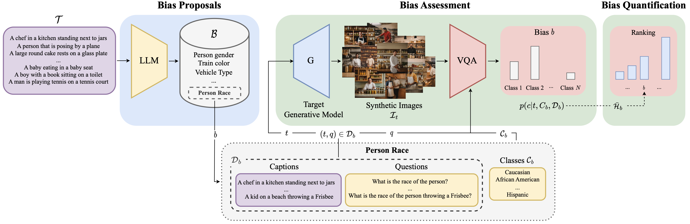

<div align="center">

# OpenBias: Open-set Bias Detection in Text-to-Image Generative Models
[[`Project Page`](https://moreno98.github.io/OpenBiasWS/)][[`arXiv`](https://arxiv.org/abs/2404.07990)][[`pdf`](https://arxiv.org/pdf/2404.07990.pdf)][[`BibTeX`](#bibtex)]

[Moreno D`Incà](https://moreno98.github.io/), [Elia Peruzzo](https://helia95.github.io/), [Massimiliano Mancini](https://mancinimassimiliano.github.io/), [Dejia Xu](https://ir1d.github.io/), [Vidit Goel](https://vidit98.github.io/), [Xingqian Xu](https://xingqian2018.github.io/), [Zhangyang Wang](https://vita-group.github.io/), [Humphrey Shi](https://www.humphreyshi.com/home), [Nicu Sebe](https://disi.unitn.it/~sebe/)

</div>

<div style="text-align: justify">

>**Abstract:** Text-to-image generative models are becoming increasingly popular and accessible to the general public. As these models see large-scale deployments, it is necessary to deeply investigate their safety and fairness to not disseminate and perpetuate any kind of biases. However, existing works focus on detecting closed sets of biases defined a priori, limiting the studies to well-known concepts. In this paper, we tackle the challenge of open-set bias detection in text-to-image generative models presenting OpenBias, a new pipeline that identifies and quantifies the severity of biases agnostically, without access to any precompiled set. OpenBias has three stages. In the first phase, we leverage a Large Language Model (LLM) to propose biases given a set of captions. Secondly, the target generative model produces images using the same set of captions. Lastly, a Vision Question Answering model recognizes the presence and extent of the previously proposed biases. We study the behavior of Stable Diffusion 1.5, 2, and XL emphasizing new biases, never investigated before. Via quantitative experiments, we demonstrate that OpenBias agrees with current closed-set bias detection methods and human judgement.

</div>



## Installation
We recomand to use a virtual environment to install the required environment. 
```bash
# Create a virtual environment and activate it
python -m venv openbias
source openbias/bin/activate
```
Before installing the required packages, please install [PyTorch](https://pytorch.org/get-started/locally/) separately according to your system and CUDA version.  
After installing PyTorch, you may install the required packages with the following commands:
```
# Upgrade pip and install requirements
pip install --upgrade pip
pip install -r requirements.txt
```

This code has been tested with `PyTorch 2.2.1`, `CUDA 11.8` and `python 3.10.9`.

## OpenBias Pipeline
OpenBias is composed of three main steps:
1. **Bias Proposal**: Given a set of captions, the Large Language Model (LLM) proposes biases.
2. **Image Generation**: The target generative model produces images using the same set of captions.
3. **Bias Detection**: A Vision Question Answering model recognizes the presence of the previously proposed biases.

Please note that captions are required for running this pipeline.  
We provide support for `COCO`, `Flickr30k` and `winobias` datasets.  
All the scripts of this pipeline `support multi GPUs`.

Please before running the pipeline make sure to **correctly update** the config file (`./utils/config.py`) with the correct paths to the datasets and model weights (e.g., LLMs and VQAs).  
Please note that the `steps.sh` script includes a full pipeline script example.

### Bias Proposal
Before running this step, make sure to update `BIAS_PROPOSAL_SETTING` of the `./utils/config.py` file.

The bias proposal step can be run using the following command:
```bash
CUDA_VISIBLE_DEVICES=0 python bias_proposals.py 
    --workers 6 
    --dataset 'coco' 
```
This script outputs a JSON file containing the proposed biases under the `./proposed_biases/` folder.
The supported datasets are `coco` and `flickr30k`.  
The number of workers and GPUs can be adjusted according to the available resources.

We make available the proposed biases for the COCO and Flickr30k datasets: [COCO](https://drive.google.com/file/d/1sL5t0x2KBdkN4CfXDnhZSufGVj314pS9/view?usp=sharing), [Flickr30k](https://drive.google.com/file/d/1fgIOHAb-KHGcWNtMp155fPBz-M-7Vddk/view?usp=sharing). For each dataset create the folder `./proposed_biases/<dataset>/3/` and move the downloaded files there accordingly.

### Image Generation
This step generates images using the chosen target generative model and by leveraging the previously proposed captions.  
Image generation can be run using the following command:
```bash
CUDA_VISIBLE_DEVICES=0 python generate_images.py --dataset coco --generator sd-xl
```
This script saves the generated images under the `./sd_generated_dataset/` folder. 

### Bias Detection
This step can be run either on generated images or real images.  
To run the bias detection on generated images, use the following command:
```bash
CUDA_VISIBLE_DEVICES=0 python run_VQA.py --vqa_model llava-1.5-13b --workers 4 --dataset 'coco' --mode 'generated' --generator sd-xl
```
You may chose the desired generated images by changing the `--generator` parameter.  
This script can be run on real images by changing the `--mode` parameter to `original`, as follows:
```bash
CUDA_VISIBLE_DEVICES=0 python run_VQA.py --vqa_model llava-1.5-13b --workers 4 --dataset 'coco' --mode 'original'
```
This script saves the results under the `./results/` folder.

### Plot the Results
The restuls can be plotted using the following command:
```bash
python make_plots.py --generator sd-xl --dataset coco --mode generated
```
Please chose the desired generator and dataset accordingly. Similarly to the bias detection step, you may chose the mode to be `original` to plot the results of the bias detection on real images.  

### Unconditional Generation
This pipeline can be used for unconditional generation as well.  
To generate images without captions, use the following command:
```bash
CUDA_VISIBLE_DEVICES=0 python StyleGan3_generation.py --n_images 100 --generator stylegan3-ffhq
```
This script uses StyleGAN3 to generate `--n_images` images and saves them under the `./sd_generated_dataset/` folder.  
Please make sure to download the StyleGAN3 `stylegan3-r-ffhq-1024x1024.pkl` weights before running this script. Place them under the `./utils/stylegan3/weights/` folder.

After generating the images, it is required to run a captioning model to generate captions for the generated images. These captions are needed to propose biases and run the bias detection step.  
This step can be run using the following command:
```bash
CUDA_VISIBLE_DEVICES=0 python captioning.py --generator stylegan3-ffhq 
```
The generated captions will be available under `./sd_generated_dataset/<generator>/` folder.  
Afterwards, the bias proposal step can be run as follows:
```bash
CUDA_VISIBLE_DEVICES=0 python bias_proposals.py --workers 6 --dataset 'stylegan3_ffhq'
```
Before running the bias detection step, please run the script `./proposed_biases/stylegan3_ffhq/add_caption_ids.py` to add caption ids.  
The bias detection step can be run as follows:
```bash
CUDA_VISIBLE_DEVICES=0 python run_VQA.py --vqa_model llava-1.5-13b --workers 4 --dataset 'ffhq' --mode 'generated' --generator stylegan3-ffhq
```

After running the above steps, you may use the `make_plots.py` script to plot the results:
```bash
python make_plots.py --generator stylegan3-ffhq --dataset ffhq --mode generated
```

## BibTeX
Please cite our work if you find it useful:
```bibtex
@InProceedings{D'Inca_2024_CVPR,
    author    = {D'Inc\`a, Moreno and Peruzzo, Elia and Mancini, Massimiliano and Xu, Dejia and Goel, Vidit and Xu, Xingqian and Wang, Zhangyang and Shi, Humphrey and Sebe, Nicu},
    title     = {OpenBias: Open-set Bias Detection in Text-to-Image Generative Models},
    booktitle = {Proceedings of the IEEE/CVF Conference on Computer Vision and Pattern Recognition (CVPR)},
    month     = {June},
    year      = {2024},
    pages     = {12225-12235}
}
```
